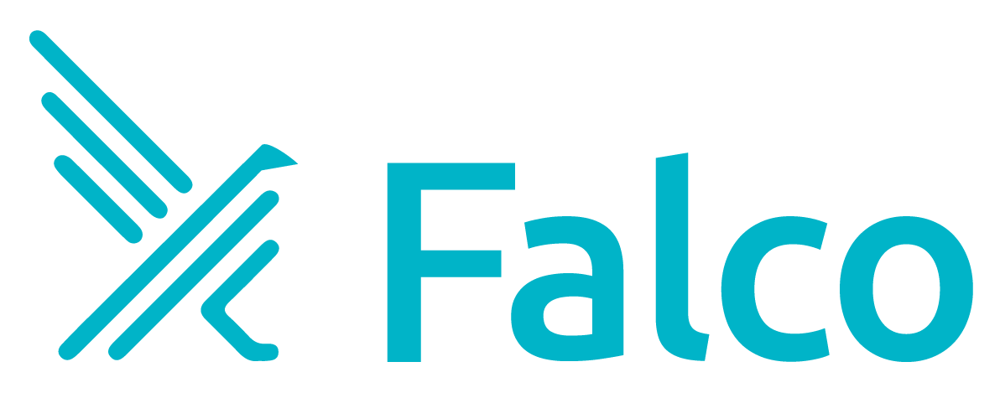

<b>Cloud Native Runtime Security.</b>

# Falco Branding Guidelines

This document describes The Falco Project's branding guidelines, language, and message.

Content in this document can be used to publically share about Falco.

### Logo

There are 3 logos available for use in this directory. Use the primary logo unless required otherwise due to background issues, or printing.

The Falco logo is Apache 2 licensed and free to use in media and publication for the CNCF Falco project.

### Slogan

> Cloud Native Runtime Security

### What is Falco?

Falco is a runtime security project originally created by Sysdig, Inc.
Falco was contributed to the CNCF in October 2018.
The CNCF now owns The Falco Project.

### What is Runtime Security?

Runtime security refers to an approach to preventing unwanted activity on a computer system. 
With runtime security, an operator deploys **both** prevention tooling (access control, policy enforcement, etc) along side detection tooling (systems observability, anomaly detection, etc).
Runtime security is the practice of using detection tooling to detect unwanted behavior, such that it can then be prevented using prevention techniques.
Runtime security is a holistic approach to defense, and useful in scenarios where prevention tooling either was unaware of an exploit or attack vector, or when defective applications are ran in even the most secure environment.

### What does Falco do?

Falco consumes signals from the Linux kernel, and container management tools such as Docker and Kubernetes.
Falco parses the signals and asserts them against security rules.
If a rule has been violated, Falco triggers an alert. 

### How does Falco work?

Falco traces kernel events and reports information about the system calls being executed at runtime.
Falco leverages the extended berkley packet filter (eBPF) which is a kernel feature implemented for dynamic crash-resilient and secure code execution in the kernel. 
Falco enriches these kernel events with information about containers running on the system.
Falco also can consume signals from other input streams such as the containerd socket, the Kubernetes API server and the Kubernetes audit log.
At runtime, Falco will reason about these events and assert them against configured security rules.
Based on the severity of a violation an alert is triggered.
These alerts are configurable and extensible, for instance sending a notification or [plumbing through to other projects like Prometheus](https://github.com/falcosecurity/falco-exporter). 

### Benefits of using Falco

 - **Strengthen Security** Create security rules driven by a context-rich and flexible engine to define unexpected application behavior.
 - **Reduce Risk** Immediately respond to policy violation alerts by plugging Falco into your current security response workflows and processes.
 - **Leverage up-to-date Rules** Alert using community-sourced detections of malicious activity and CVE exploits.
    
### Falco and securing Kubernetes

Securing Kubernetes requires putting controls in place to detect unexpected behavior that could be malicious or harmful to a cluster or application(s). 

Examples of malicious behavior include: 

 - Exploits of unpatched and new vulnerabilities in applications or Kubernetes itself. 
 - Insecure configurations in applications or Kubernetes itself. 
 - Leaked or weak credentials or secret material.
 - Insider threats from adjacent applications running at the same layer. 

Falco is capable of [consuming the Kubernetes audit logs](https://kubernetes.io/docs/tasks/debug-application-cluster/falco/#use-falco-to-collect-audit-events).
By adding Kubernetes application context, and Kubernetes audit logs teams can understand who did what.
                                 
### Writing about Falco

##### Yes

Notice the capitalization of the following terms.

 - The Falco Project
 - Falco

##### No

 - falco
 - the falco project
 - the Falco project

### Encouraged Phrasing

Below are phrases that the project has reviewed, and found to be effective ways of messaging Falco's value add.
Even when processes are in place for vulnerability scanning and implementing pod security and network policies, not every risk will be addressed. You still need mechanisms to confirm these security barriers are effective, help configure them, and provide with a last line of defense when they fail.

##### Falco as a factory

This term refers to the concept that Falco is a stateless processing engine. A large amount of data comes into the engine, but meticulously crafted security alerts come out.

##### The engine that powers...

Falco ultimately is a security engine. It reasons about signals coming from a system at runtime, and can alert if an anomaly is detected.

##### Anomaly detection

This refers to an event that occurs with something unsual, concerning, or odd occurs.
We can associate anomalies with unwanted behavior, and alert in their presence.

##### Detection tooling

Falco does not prevent unwanted behavior.
Falco however alerts when unusual behavior occurs.
This is commonly referred to as **detection** or **forensics**.

---

# Glossary 

#### Probe

Used to describe the `.o` object that would be dynamically loaded into the kernel as a secure and stable (e)BPF probe. 
This is one option used to pass kernel events up to userspace for Falco to consume.
Sometimes this word is incorrectly used to refer to a `module`.

#### Module

Used to describe the `.ko` object that would be loaded into the kernel as a potentially risky kernel module.
This is one option used to pass kernel events up to userspace for Falco to consume.
Sometimes this word is incorrectly used to refer to a `probe`.

#### Driver 

The global term for the software that sends events from the kernel. Such as the eBPF `probe` or the `kernel module`.

#### Falco

The name of the project, and also the name of [the main engine](https://github.com/falcosecurity/falco) that the rest of the project is built on.

#### Sysdig, Inc

The name of the company that originally created The Falco Project, and later donated to the CNCF.

#### sysdig 

A [CLI tool](https://github.com/draios/sysdig) used to evaluate kernel system events at runtime. 

