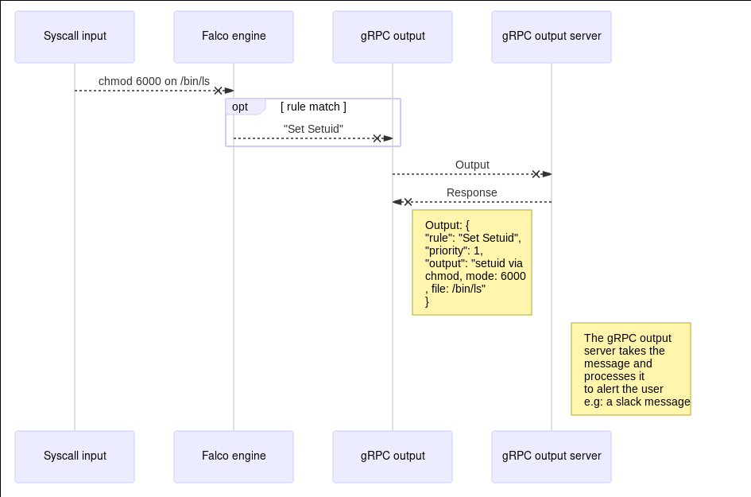

# gRPC Falco Output

<!-- toc -->

- [Summary](#summary)
- [Motivation](#motivation)
  * [Goals](#goals)
  * [Non-Goals](#non-goals)
- [Proposal](#proposal)
  * [Use cases](#use-cases)
  * [Diagrams](#diagrams)
  * [Design Details](#design-details)

<!-- tocstop -->

## Summary

We intend to build a simple gRPC server and SDKs - eg., [falco#785](https://github.com/falcosecurity/falco/issues/785) - to allow users receive and consume the alerts regarding the violated rules.

## Motivation

The most valuable information that Falco can give to its users are the alerts.

An alert is an "output" when it goes over a transport, and it is emitted by Falco every time a rule is matched.

At the current moment, however, Falco can deliver alerts in a very basic way, for example by dumping them to standard output.

For this reason, many Falco users asked, with issues - eg., [falco#528](https://github.com/falcosecurity/falco/issues/528) - or in the [slack channel](https://sysdig.slack.com) if we can find a more consumable way to implement Falco outputs in an extensible way.

The motivation behind this proposal is to design a new output implementation that can meet our user's needs.

### Goals

- To decouple the outputs from the Falco code base
- To design and implement an additional output mode by mean of a gRPC **streaming** server
- To keep it as simple as possible
- To have a simple contract interface
- To only have the responsibility to route Falco output requests and responses
- To continue supporting the old output formats by implementing their same interface
- To be secure by default (**mutual TLS** authentication)
- To be **asynchronous** and **non-blocking**
- To implement a Go SDK

### Non-Goals

- To substitute existing outputs (stdout, syslog, etc.)
- To support different queing systems than the default (round-robin) one
- To support queuing mechanisms for message retransmission
  - Users can have a local gRPC relay server along with Falco that multiplexes connections and handles retires and backoff
- To change the output format
- To make the message context (text, fields, etc.) and format configurable
  - Users can already override rules changing their output messages
- To act as an orchestrator for Falco instances

## Proposal

### Use cases

- Receive Falco events with a well-defined contract over wire
- Integrate Falco events with existing alerting/paging mechanisms
- Integrate Falco events with existing monitoring infrastructures/tools
- Falco outputs SDKs for different languages

### Diagrams

The following sequence diagram illustrates the flow happening for a single rule being matched and the consequent alert through the gRPC output client.



### Design Details

Here is the proto3 contracts definitions for the client and the server SDK.

```proto3
syntax = "proto3";

import "google/protobuf/timestamp.proto";
import "schema.proto";

package falco.output;

option go_package = "github.com/falcosecurity/client-go/pkg/api/output";

// The `subscribe` service defines the RPC call
// to perform an output `request` which will lead to obtain an output `response`.
service service {
  rpc subscribe(request) returns (stream response);
}

// The `request` message is the logical representation of the request model.
// It is the input of the `subscribe` service.
// It is used to configure the kind of subscription to the gRPC streaming server.
message request {
  bool keepalive = 1;
  // string duration = 2; // TODO(leodido, fntlnz): not handled yet but keeping for reference.
  // repeated string tags = 3; // TODO(leodido, fntlnz): not handled yet but keeping for reference.
}

// The `response` message is the logical representation of the output model.
// It contains all the elements that Falco emits in an output along with the
// definitions for priorities and source.
message response {
  google.protobuf.Timestamp time = 1;
  falco.schema.priority priority = 2;
  falco.schema.source source = 3;
  string rule = 4;
  string output = 5;
  map<string, string> output_fields = 6;
  // repeated string tags = 7; // TODO(leodido,fntlnz): tags not supported yet, keeping for reference
}
```

---
