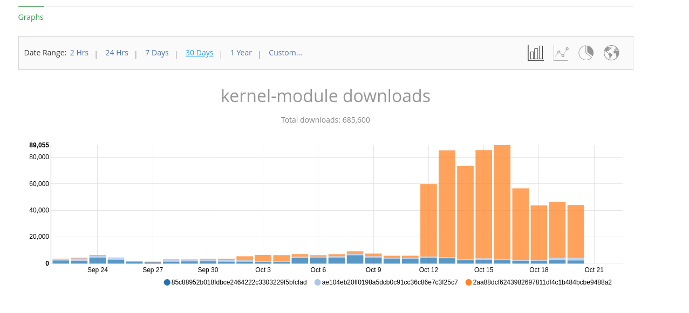

# Falco Drivers Storage S3

Supersedes: [20200818-artifacts-storage.md#drivers](20200818-artifacts-storage.md#drivers)

Supersedes: [20200901-artifacts-cleanup.md#drivers](20200901-artifacts-cleanup.md#drivers)

## Introduction

In the past days, as many people probably noticed, Bintray started rate-limiting our users, effectively preventing them from downloading any kernel module, rpm/deb package or any pre-built dependency we host there.

This does not only interrupt the workflow of our users but also the workflow of the contributors, since without bintray most of our container images and CMake files can’t download the dependencies we mirror.

### What is the cause?

We had a spike in adoption apparently, either a user with many nodes or an increased number of users. We don’t know this detail specifically yet because bintray does not give us very fine-grained statistics on this.

This is the 30-days history:

As you can see, we can only see that they downloaded the latest kernel module driver version, however we can’t see if:

* It’s a single source or many different users

* What is the kernel/OS they are using

### What do we host on Bintray?

* RPM packages: high traffic but very manageable ~90k downloads a month

* Deb packages:low traffic ~5k downloads a month

* Pre-built image Dependencies: low traffic, will eventually disappear in the future

* Kernel modules: very high traffic, 700k downloads in 10 days, this is what is causing the current problems. They are primarily used by users of our container images.

* eBPF probes: low traffic ~5k downloads a month

### Motivations to go to S3 instead of Bintray for the Drivers

Bintray does an excellent service at building the rpm/deb structures for us, however we also use them for S3-like storage for the drivers. We have ten thousand files hosted there and the combinations are infinite.

Before today, we had many issues with storage even without the spike in users we are seeing since the last ten days.

## Context on AWS

Amazon AWS, recently gave credits to the Falco project to operate some parts of the infrastructure on AWS. The CNCF is providing a sub-account we are already using for the migration of the other pieces (like Prow).

## Interactions with other teams and the CNCF

* The setup on the AWS account side already done, this is all technical work.

* We need to open a CNCF service account ticket for the download.falco.org subdomain to point to the S3 bucket we want to use

## The Plan

We want to propose to move the drivers and the container dependencies to S3.

#### Moving means:

* We create a public S3 bucket with [stats enabled](https://docs.aws.amazon.com/AmazonS3/latest/dev/analytics-storage-class.html)

* We attach the bucket to a cloudfront distribution behind the download.falco.org subdomain

* We move the current content keeping the same web server directory structure

* We change the Falco Dockerfiles and driver loader script accordingly

* We update test-infra to push the drivers to S3

* Once we have the drivers in S3, we can ask bintray to relax the limits for this month so that our users are able to download the other packages we keep there. Otherwise they will have to wait until November 1st. We only want to do that after the moving because otherwise we will hit the limits pretty quickly.

#### The repositories we want to move are:

* [https://bintray.com/falcosecurity/driver](https://bintray.com/falcosecurity/driver) will become https://download.falco.org/driver

* [https://bintray.com/falcosecurity/dependencies](https://bintray.com/falcosecurity/dependencies) will become https://download.falco.org/dependencies

#### Changes in Falco

* [Search for bintray ](https://github.com/falcosecurity/falco/search?p=2&q=bintray)on the Falco repo and replace the URL for the CMake and Docker files.

* It’s very important to change the DRIVERS_REPO environment variable [here](https://github.com/falcosecurity/falco/blob/0a33f555eb8e019806b46fea8b80a6302a935421/CMakeLists.txt#L86) - this is what updates the falco-driver-loader scripts that the users and container images use to fetch the module

#### Changes in Test Infra

* We need to use the S3 cli instead of jfrog cli to upload to the s3 bucket after building [here](https://github.com/falcosecurity/test-infra/blob/master/.circleci/config.yml)

* We can probably remove jfrog from that repo since it only deals with drivers and drivers are being put on S3 now

* Instructions on how to setup the S3 directory structure [here](https://falco.org/docs/installation/#install-driver)

    * `/$driver_version$/falco_$target$_$kernelrelease$_$kernelversion$.[ko|o]`

#### Changes to Falco website

* Changes should not be necessary, we are not updating the way people install Falco but only the driver. The driver is managed by a script we can change.

## Mitigation and next steps for the users

* **The average users should be good to go now, Bintray raised our limits and we have some room to do this without requiring manual steps on your end**

* **Users that can’t wait for us to have the S3 setup done: **can setup an S3 as driver repo themselves, push the drivers they need to it after compiling them (they can use [Driverkit](https://github.com/falcosecurity/driverkit) for that) Instructions on how to setup the S3 directory structure [here](https://falco.org/docs/installation/#install-driver).

* **Users that can’t wait but don’t want to setup a webserver themselves**: the falco-driver-loader script can also compile the module for you. Make sure to install the kernel-headers on your nodes.

* **Users that can wait** we will approve this document and act on the plan described here by providing the DRIVERS_REPO at  [https://download.falco.org/driver](https://download.falco.org/driver) that then you can use

### How to use an alternative DRIVERS_REPO ?

**On bash:**

export DRIVERS_REPO=https://your-url-here

**Docker**

Pass it as environment variable using the docker run flag -e - for example:

docker run -e DRIVERS_REPO=[https://your-url-here](https://your-url-here)

**Kubernetes**

spec:

  containers:

  - env:

    - name: DRIVERS_REPO

      value: https://your-url-here

## Release

Next release is on December 1st, we want to rollout a hotfix 0.26.2 release that only contains the updated script before that date so that users don’t get confused and we can just tell them "update Falco" to get the thing working again.

