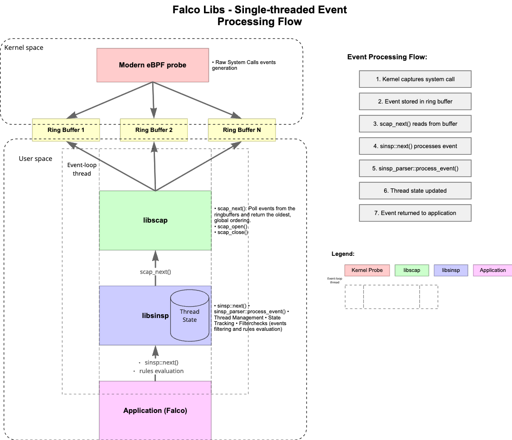
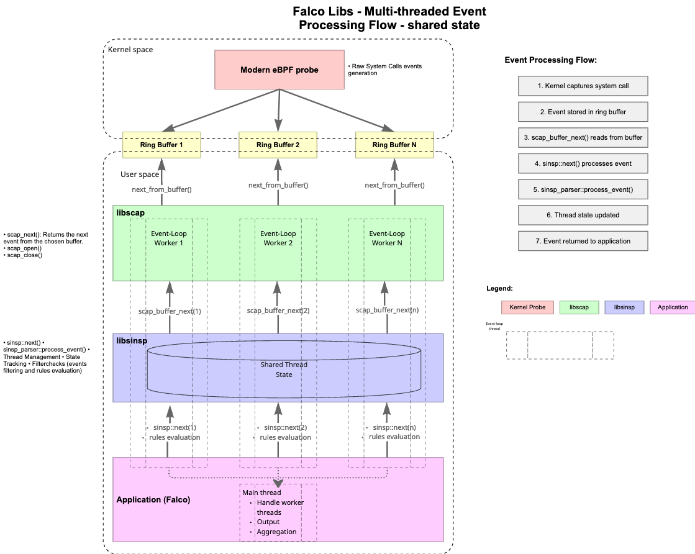

# Multi-Threaded Falco High-Level Design (Working draft)

## Summary

This document outlines a high-level design for implementing multi-threading in Falco. The goal of this proposal is to overcome Falco's single-threaded architecture to improve scalability in scenarios where the amount of events produced cannot be processed in a single thread. This is achieved by leveraging multiple threads for event processing, rule evaluation, and output handling, enabling Falco to better utilize multi-core systems and reduce event drops under high event rates.

## Goals

* Address the problems related to single CPU core saturation, leading to dropped events.
* Minimize the performance impact on the single threaded usage, that remains the default. 

## Non-Goals

* This document does not cover low-level implementation details that will be addressed in specific design documents for each component or directly in the implementation phase.
* This document does not focus on performance optimization, the primary goal is scalability improvements to handle higher event rates that exceed single-thread processing capacity.

## Success Metrics

The success of this multi-threading initiative will be measured by the following key metrics:

* **Event Drop Rate Reduction**: The primary success metric is the reduction in event drops under high event rates. A successful implementation should significantly reduce or eliminate event drops that occur when a single thread cannot keep up with the event rate.
* **Throughput Scaling**: The system should demonstrate improved throughput (events processed per second) that scales with the number of worker threads, up to a reasonable limit based on available CPU cores and workload characteristics.
* **CPU Utilization**: Multi-threaded Falco should better utilize available CPU cores, with worker threads distributing load across multiple cores instead of saturating a single core.
* **Single-Threaded Performance Preservation**: The single-threaded mode (default) should maintain its current performance characteristics, with minimal or no performance regression when multi-threading is disabled.

These metrics will be evaluated through benchmarking and real-world deployment scenarios to validate that the multi-threaded architecture achieves its scalability goals without compromising correctness or introducing significant overhead.

## High-Level Design

### Current Architecture



* The kernel driver (via kmod or eBPF) writes events into per-CPU ring buffers. Each CPU has its own buffer to avoid lock contention. We have a ring buffer per CPU core, and a single userspace.
* Userspace (libscap) performs an `O(n_cpus)` scan on every next() call, it peeks at the head event from each ring buffer, finds the event with the minimum timestamp across all buffers and returns that event to Falco for processing. The consumer position is only advanced after the event has been consumed (on the next call), ensuring the caller can safely read the event data and avoiding the need to perform copies of the event data.
* Libsinsp processes the events sequentially as they are received from libscap, building a stateful representation of the system and providing the necessary context for rule evaluation.
* Falco evaluates the rules against the processed events and generates alerts based on the defined security policies.

### Proposed Architecture Overview



* The kernel driver (modern eBPF probe) routes events into per-partition ring buffers based on TGID. The routing logic executes in kernel space (within the eBPF program), where each event's TGID is hashed and used to select the target ring buffer. Only the modern eBPF probe is supported, as it relies on [BPF_MAP_TYPE_RINGBUF](https://docs.ebpf.io/linux/map-type/BPF_MAP_TYPE_RINGBUF/) which does not have a per-CPU design as opposed to the `BPF_MAP_TYPE_PERF_EVENT_ARRAY` used by the legacy eBPF probe.
* Each ring buffer is associated with an event loop worker thread that processes events from its assigned ring buffer.
* The `libsinsp` state (e.g., the thread state) is maintained in a shared data structure, allowing all workers to access data pushed by other workers. This is crucial for handling events like clone() that rely on data written by other partitions. This requires designing lightweight synchronization mechanisms to ensure efficient access to shared state without introducing significant contention. A dedicated proposal document will address the design of the shared state and synchronization mechanisms, and data consistency.
* Falco's rule evaluation is performed in parallel by multiple worker threads, each evaluating rules against the events they process. Current Falco plugins are not supposed to be thread-safe. A dedicated proposal document will address the design of a thread-safe plugin architecture.
* **Output handling** is already designed for multi-threaded access. The `falco_outputs` class implements a thread-safe, queue-based architecture using Intel TBB's `concurrent_bounded_queue`, which is specifically designed for multi-producer, single-consumer scenarios. Multiple worker threads can concurrently call `handle_event()` to enqueue alert messages using the thread-safe `try_push()` operation. A dedicated output worker thread consumes messages from the queue using `pop()` and sends them to all configured outputs (stdout, file, syslog, gRPC, HTTP, etc.). This design is already proven in production, as Falco's multi-source support (where different event sources run in separate threads) already uses this same queue concurrently. The existing implementation requires no changes to support multi-threaded event processing. Note that while outputs are processed in order within the queue, alerts from different worker threads may be interleaved, meaning strict temporal ordering of alerts across different processes is not guaranteed. This is acceptable for security monitoring use cases where the primary concern is detecting and reporting security events rather than maintaining precise event ordering.

### Work Partitioning Strategies

A crucial and challenging design aspect is partitioning the work to achieve a good trade-off among the following properties:

1. **Even load balancing** between threads
2. **Low contention** on shared data (or no shared data)
3. **Avoiding temporal inconsistencies and causality violations** (e.g., processing a file-opening event before the related process-forking event)

The first two properties are primarily focused on performance, while the third is essential for the correctness of the solution. These aspects are intrinsically linked.

Based on the analysis below, **Static Partitioning by TGID** is the proposed approach for the initial implementation.

#### Static Partitioning by TGID (Thread Group ID / Process ID)

Events are routed based on the TGID in kernel space (within the eBPF program) to a ring buffer dedicated to a specific partition. The routing logic executes at the point where events are captured, before they are written to any ring buffer. This partition is then consumed by a dedicated worker thread in userspace. The routing in the eBPF program can be accomplished with a simple hash and modulo operation, depending on the desired number of worker threads:

```
ring_buffer_index = hash(event->tgid) % num_workers
```

The hash function and number of workers are configured at eBPF program initialization time, allowing the kernel to route events directly to the appropriate ring buffer without userspace intervention.

**Pros:**

* **Reduced need for thread synchronization**: While structures keeping thread group data are shared across all worker threads and require synchronization, TGID partitioning minimizes cross-partition access. For data stored per thread-group (such as file descriptors), TGID partitioning guarantees a single writer (the worker thread assigned to that TGID), resulting in low contention since the data is mostly accessed by the same partition. Synchronization is needed only in two specific cases:
  1. **Clone/fork events**: When handling clone/fork events, the worker thread needs to access thread information from the parent thread, which may reside in a different partition. This requires synchronization to read the parent's state (e.g., file descriptors, environment variables) that will be inherited by the child.
  2. **Proc exit events**: When a process exits, reparenting logic may need to access thread information from other partitions to handle child processes that are being reparented to a different thread group.
* Guarantee of sequential order processing of events related to the same thread group/process, as they are handled by the same worker thread. This limits the chance of temporal inconsistencies.

**Cons:**

* **Load Imbalance / "Hot" Process Vulnerability**: This static partitioning is susceptible to uneven worker load distribution, as a small number of high-activity ("hot") processes can overload the specific worker thread assigned to their TGID, creating a bottleneck.
* **Cross-Partition Temporal Inconsistency**: Events that require information from a parent thread (e.g., fork/clone events) can still lead to causality issues. If the parent's related event is handled by a different, lagging partition, the required context might be incomplete or arrive out of order. Note that load imbalance amplifies this issue. Missing thread information is easy to detect, but there are also cases where information is present but not up-to-date or ahead of the time the clone event happened.

  **Ancestor information during rule evaluation**: When evaluating rules that require ancestor information, the worker thread may need to access thread data from other partitions. Falco rules commonly check ancestor process attributes using fields that traverse the process hierarchy. Based on actual usage in Falco rules, commonly used ancestor fields include:
  
  - `proc.aname` / `proc.aname[N]` - ancestor process name (where N is the generation level: 1=parent, 2=grandparent, 3=great-grandparent, etc., up to at least level 7)
  - `proc.aexepath[N]` - ancestor executable path (e.g., `proc.aexepath[2]` for grandparent)
  - `proc.aexe[N]` - ancestor executable (e.g., `proc.aexe[2]` for grandparent)
  
  Accessing stale or "ahead" ancestor data (where the ancestor's state may be out of date or from events processed by other partitions with different timestamps) could lead to false positives or false negatives in rule evaluation. We acknowledge this potential issue and plan to assess its impact and determine appropriate mitigations once we have a running prototype.

**Mitigations:**

* **Last-Resort Fetching**: Fetching the thread information from a different channel to resolve the drift (e.g., proc scan, eBPF iterator). This solution is considered as a last resort because it risks slowing down the event processing loop, potentially negating the performance benefits of multi-threading.

* **Context Synchronization**: Wait for the required thread information to become available. This can be decomposed into two orthogonal concerns:

  **How to handle the wait:**

  * **Wait/Sleep (Blocking)**: The worker thread blocks (sleeping or spinning) until the required data becomes available. Simple to implement, but the worker is idle during the wait, reducing throughput.
  * **Deferring (Non-blocking)**: The event is copied/buffered for later processing; the worker continues with other events from its ring buffer. More complex (requires event copying, a pending queue, and a retry mechanism), but keeps the worker productive.

  **How to detect data readiness:**

  * **Polling**: Periodically check if the required data is available (spin-check for Wait/Sleep, or periodic retry for Deferring). Simple but wastes CPU cycles.
  * **Signaling**: Partitions proactively notify each other when data is ready. More efficient but requires coordination infrastructure (e.g., condition variables, eventfd, or message queues).

  These combine into four possible approaches:

  | | Polling | Signaling |
  |---|---------|-----------|
  | **Wait/Sleep** | Spin-check until ready | Sleep on condition variable, wake on signal |
  | **Deferring** | Periodically retry deferred events | Process deferred events when signaled |

  **Synchronization point**: A natural synchronization point is the **clone exit parent event**. At this point, the parent process has completed setting up the child's initial state (inherited file descriptors, environment, etc.), making it safe to start processing events for the newly created thread group.

  **Special case — `vfork()` / `CLONE_VFORK`**: When `vfork()` is used, the parent thread is blocked until the child calls `exec()` or exits, delaying the clone exit parent event. An alternative synchronization point may be needed (e.g., adding back clone enter parent).

### Other Considered Approaches

#### Static Partitioning by TID (Thread ID)

Similar to the previous approach, but events are routed by TID instead of TGID.

**Pros:**

* Guarantee of sequential order processing of events related to the same thread, as they are handled by the same worker thread. This limits the chance of temporal inconsistencies.
* Good enough load balancing between partitions.

**Cons:**

* **Cross-Partition Temporal Inconsistency**: This approach can lead to temporal inconsistencies when accessing/writing information from/to other processes or from the Thread Group Leader (e.g., environment, file descriptor information is stored in the thread group leader).

#### Static Partitioning by CPU Core

This approach routes events based on the CPU core where the event was captured. Each CPU core has its own ring buffer (per-CPU buffers), and multiple CPU buffers are assigned to the same partition. Each partition is consumed by a dedicated worker thread that reads from all the per-CPU buffers assigned to it. The number of partitions does not necessarily match the number of CPU cores—a single partition can read from multiple per-CPU buffers, allowing flexibility in choosing the number of worker threads independently from the number of CPU cores. This leverages the existing per-CPU ring buffer infrastructure used by the kernel module (kmod) and legacy eBPF probe, where events are written to per-CPU buffers that are then grouped into partitions consumed by worker threads.

**Pros:**

* **Natural Load Distribution**: Events are naturally distributed across CPUs based on where processes execute, providing inherent load balancing that reflects actual system activity.
* **No Routing Logic Required**: Uses the existing per-CPU ring buffer design, eliminating the need for custom routing logic in kernel or userspace. CPU cores are simply mapped to partitions (e.g., via modulo operation: `partition = cpu_id % num_workers`), and each worker thread reads from all per-CPU buffers assigned to its partition.
* **Low Synchronization Overhead**: Events from per-CPU buffers assigned to the same partition are processed sequentially by the same worker thread, reducing cross-thread synchronization needs.
* **Flexible Partitioning**: The number of partitions (and thus worker threads) can be chosen independently from the number of CPU cores, allowing optimization based on workload characteristics rather than hardware topology.

**Cons:**

* **Cross-CPU Temporal Inconsistency**: Events from the same process or thread group can be processed by different worker threads if the process migrates between CPUs, leading to potential temporal inconsistencies and causality violations. This is particularly problematic for multi-threaded applications that may execute on different CPUs.
* **Process Migration Effects**: CPU migration can cause events from the same process to be processed out of order, as events captured on different CPUs are handled by different worker threads.
* **Load Imbalance with CPU Grouping**: When multiple per-CPU buffers are assigned to the same partition, the worker thread must process events from all assigned buffers. If the activity levels across these CPUs are uneven, the worker thread may experience load imbalance, with some partitions handling more active CPUs than others. The worker thread must also coordinate reading from multiple buffers, potentially using techniques similar to the current `O(n_cpus)` scan to maintain event ordering.
* **Modern eBPF Probe Limitation**: The modern eBPF probe uses `BPF_MAP_TYPE_RINGBUF`, which does not have a per-CPU design. This approach would only be viable with the kernel module (kmod) or legacy eBPF probe that use `BPF_MAP_TYPE_PERF_EVENT_ARRAY` with per-CPU buffers.

#### Functional Partitioning (Pipelining)

Instead of partitioning the data, this approach partitions the work by splitting processing into phases:

1. **Parsing**: Runs in a single thread, the state is updated in this phase.
2. **Rules evaluation**: Runs in a thread chosen from a worker thread pool, the state is accessed but not modified.

**Pros:**

* The state handling remains single-threaded, avoiding any synchronization issue on the write side.
* The load balancing of the Rules evaluation phase is good as it does not require any form of stickiness. Every worker can take whatever event, and a simple round-robin policy can be applied.

**Cons:**

* The "Parsing" stage is likely to become the bottleneck; a single thread here limits total throughput regardless of how many cores you have.
* As we are parallelizing parsing and rules evaluation phases, we need an MVCC (multi-version concurrency control) technique to maintain multiple levels of state to use the state at the right point in time during rules evaluation.
* Processing multiple events in parallel involves changes at the driver and libscap level. At the moment we are processing one event at a time from the driver memory without copying. To be able to process multiple events in parallel, we need to adapt the ring-buffer to make sure that `next()` does not consume the event. We would also need some flow control (e.g., backpressure) to avoid processing too many events in parallel. This problem would arise only if the rules evaluation phase is slower than the parsing phase.

#### Comparison Summary

| Approach | Load Balancing | Contention | Temporal Consistency |
|----------|----------------|------------|----------------------|
| TGID | Moderate (hot process risk) | Low | Good (within process) |
| TID | Good | Higher | Partial (thread-level only) |
| CPU Core | Good | Low | Poor (process migration issues) |
| Pipelining | Good (rules evaluation phase) | Low (writes) | Requires MVCC |

#### Rationale for TGID Partitioning

TGID partitioning was chosen because it offers the best balance between synchronization complexity and correctness guarantees. TID partitioning increases cross-partition access for thread group leader data (e.g., file descriptor table, working directory, environment variables), increasing the coordination cost. Per-CPU partitioning, while leveraging existing infrastructure, suffers from process migration issues that can cause significant temporal inconsistencies when processes move between CPUs. Functional partitioning, while elegant in its separation of concerns, introduces a single-threaded bottleneck in the parsing phase that limits scalability regardless of available cores, and requires complex MVCC mechanisms for data consistency and mechanisms for handling multiple events in parallel.

### Risks and Mitigations

- **Increased Complexity**: Multi-threading introduces complexity in terms of synchronization and state management. Mitigation: Careful design of shared state and synchronization mechanisms, along with thorough testing.
- **Synchronization Overhead vs Performance Gains**: The overhead of synchronization might negate the performance benefits of multi-threading. Mitigation: Use lightweight synchronization techniques and minimize shared state access.
- **Synchronization Overhead vs Data Consistency**: In order to keep the synchronization overhead low with the shared state, we might need to relax some data consistency guarantees. Mitigation: Analyze the trade-offs and ensure that any relaxed guarantees do not compromise security.
